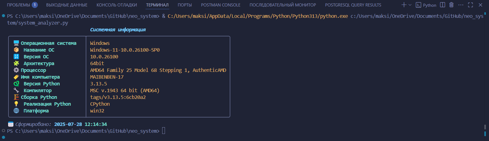
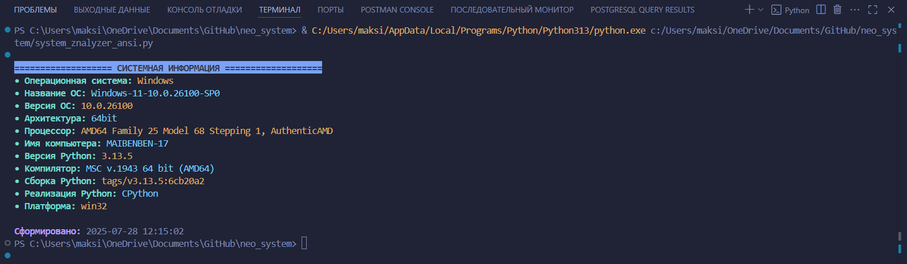

# NEO_SYSTEM - Интеллектуальный анализатор системы

**NEO_SYSTEM** - продвинутый инструмент для сбора и визуализации системной информации с эстетичным цветным выводом в терминал.

Проект предоставляет детальную информацию об операционной системе, железе и программном окружении в стильном оформлении.

> Как пример, возможное использование названия - `py_system_info`

## 🚀 Особенности

- 🌈 **Яркий цветной вывод** с поддержкой эмодзи
- 📊 **Комплексный анализ** аппаратных и программных компонентов
- ⚡ **Мгновенное выполнение** без зависимостей (`ANSI-версия`)
- 🎨 **Профессиональное оформление** через `Rich` (опционально)
- 📅 **Автоматическое определение** даты и времени сбора данных

## 🖥️ Поддерживаемые системы

| Операционная система | Статус       |
|----------------------|--------------|
| Windows              | ✅ Полностью  |
| Linux                | ✅ Полностью  |
| macOS                | ✅ Полностью  |
| BSD                  | ⚠️ Частично  |

## ⬇️ Установка

### Базовый вариант (ANSI-цвета)

```bash
git clone https://github.com/QuadDarv1ne/neo_system.git
cd neo_system
python system_analyze_ansi_.py
```

### Продвинутый вариант (с Rich)

```bash
pip install rich
python system_analyzer.py --rich
```

## 📸 Скриншоты





## 🛠️ Технологии

- `Python 3.7+`
- Стандартные библиотеки: `platform`, `sys`, `datetime`
- [Rich](https://github.com/Textualize/rich) (опционально)

## 🤝 Участие в проекте

**Приветствуются:**

- Идеи по улучшению визуализации
- Переводы на другие языки
- Тестирование на редких конфигурациях
- Дополнение системной информации


---

## 📜 Лицензия

[Этот проект лицензирован под лицензией MIT](LICENCE)

Для получения дополнительной информации ознакомьтесь с файлом `LICENSE`

---

💼 **Автор:** Дуплей Максим Игоревич

📲 **Telegram:** @quadd4rv1n7

📅 **Дата:** 28.07.2025

▶️ **Версия 1.0**

```textline
※ Предложения по сотрудничеству можете присылать на почту ※
📧 maksimqwe42@mail.ru
```

---

<div align="center">
💖 Сделано с любовью к Python и красивым консолям 💖
</div>
